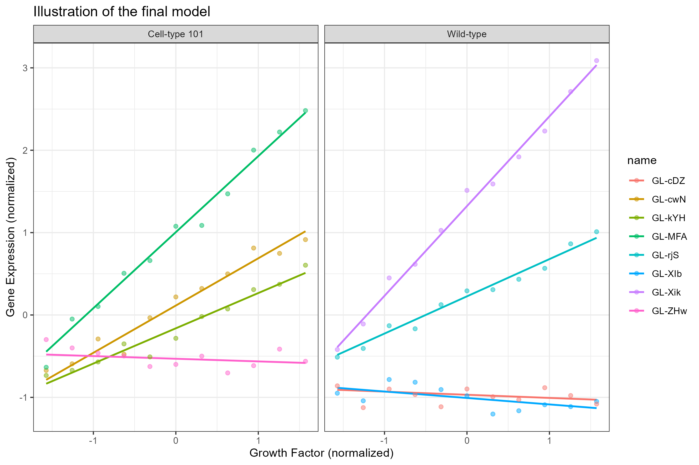

```{r setup, include=FALSE}
knitr::opts_chunk$set(echo = TRUE)
```


```{r,echo=FALSE}

pacman::p_load(tidyverse,targets,readxl,gt,showtext)
```
<<<<<<< HEAD
The whole project used "targets" pipeline. To run the project, install package "targets" in R using command "library(targets)" first and then run the command "tar_make()". All code should be executed automatically. For more details, please read "README-R.html".

If you have any problems, feel free to email shufan.w @ outlook.com.

=======
>>>>>>> 0e780b41a5106c8d22ff62ecc9318c1fd7496456
# Introduction

This project aimed to investigate how the new treatment "Acitivating factor 42" influence the cell's gene expression. The dataset in the project is provided by Dr. Karl Beartor.

Here is the introduction of the dataset:

The csv dataset includes 88 obversations and 5 variables. 

cell-line: categorical variables with values "Wild-type", "Cell-type 101", "WILD-TYPE" and "CELL-TYPE 101".

treatment: categorical variables with values "Placebo" and "Activating factor 42".

name: categorical variables with 8 possible values. do not know what it represents for.

conc: concentration. numerical variables. with integer values ranges from 0 to 10.

gene_expression: numerical variables. response variables

In the project, we cleaned the dataset and performed the exploratory data analysis. According to the exploratory data results, we tried different mixed-effect linear models. We selected the final model with smallest AIC and performed the Likelihood ratio tests with significant levels of 0.05 to investigated whether the complex model with better performance is significantly better than other sampler models. Meanwhile, the Likelihood ratio tests also helped as determine whether a specific predictor had significant influence on the predictions.

A IMRaD report summrized works done and results got in this project, which can be found in 

```{r,echo=FALSE}
here::here("resources/IMRad.pdf")
```

A Powerpoint of EDA can be founded in
```{r,echo=FALSE}
here::here("resources/gene_EDA.pptx")
```
The figures and tables used in the PPT and IMRaD report can be found in the following pathes:

figures:
```{r,echo=FALSE}
here::here("figs")
```

tabs
```{r,echo=FALSE}
here::here("tabss")
```


# 2024-3-3 EDA for raw data

The code of exploring the raw data can be found in 
```{r,echo=FALSE}
here::here("R/gene_raw")
```


The EDA of the raw data has been done to see if the data needed to be cleaned. All the operations's results were stored in this list.

```{r}
raw_EDA_list <- tar_read(gene_raw_EDA)
```


I firstly checked the summary of the raw data.

The raw data have 88 observations and 5 variables: 3 categoritical variables (cell_line, treatment, name) and 2 numerical variables(conc, gene_expression)

```{r}
print(raw_EDA_list$summary, width=Inf)
```
According to @fig-missing-value, there is no missing values in the dataset.
```{r}
#| fig-cap: Missing values plot
#| label: fig-missing-value
raw_EDA_list$missing_plot
```


There are two class in the cell_line: "Cell-type 101" and "Wild-type".
We need to fix the typos.
```{r}
raw_EDA_list$cell_line_count
```

2 classes in treatment: Activating factor 42" and "Placebo".
Need to fix the typos.
```{r}
raw_EDA_list$treatment_count
```

8 classes in name.
Need to fix the typos.
```{r}
raw_EDA_list$name_count
```
According to @fig-histgrow, all 8 classes of cells have been tested with 11 different growth factors. No missing tests. :D
```{r}
#| fig-cap: Histogram of growth factor.
#| label: fig-histgrow
raw_EDA_list$conc_histgram
```


According to @fig-histgenexp, the distribution of gene expression is unimodal and right-skewed. The majority of observations had gene expression <25. After checking with Karl, the gene expression > 25 are not outliers
```{r}
#| fig-cap: Histogram of gene expression.
#| label: fig-histgenexp
raw_EDA_list$expression_histgram
```


## 2024-3-10 Data clean

The code of data cleaning can be founded in 
```{r,echo=FALSE}
here::here("R/clean_gene")
```


We cleaned the data by fixing all the typos in the dataset.
```{r}
tar_load(gene_clean)
head(gene_clean)
```
# 2024-3-11 EDA for cleaned data

Tne code of EDA for cleaned data can be found in 

```{r,echo=FALSE}
here::here("R/EDA_gene_cleaned")
```


In @fig-coplot, every subplot represents how gene expression changes with the values of growth factors for different names.  
The name strongly influenced the relationship between gene expression and growth factors.


```{r}
#| fig-cap: Conditioning plots of gene expression vs growth factor with different name
#| label: fig-coplot
colnames(gene_clean)[4]<- c('growth_factor')
coplot(gene_expression ~ growth_factor|name,data=gene_clean)
```


```{r}
tar_load(gene_clean_EDA)
```


Scatter plots of gene expression and growth factor are drawn.

Both @fig-scatter_wild and @fig-scatter_cell indicated that the strong linear relationships between gene expression and growth factor were greatly influenced by the names, which is consistenty with @fig-coplot. Moreover, the effects of treatment "Activating factor 42" on gene expression were also varied with different name. A mixed-effect model with random intercept and coefficients may fit the data well.

```{r}
#| fig-cap: Scatter plot of gene expression vs growth factor with different treatments,names and cell line Wild-type
#| label: fig-scatter_wild
gene_clean_EDA$scatter_Gene_vs_Conc_wild
```


```{r}
#| fig-cap: Scatter plot of gene expression vs growth factor with different treatments,names and cell line Cell-type 101
#| label: fig-scatter_cell
gene_clean_EDA$scatter_Gene_vs_Conc_cell
```


@fig-boxplot illustrated the median values and IQR of the gene expression with different growth factor and treatments. The introduction of boxplot can be found in 
Variations of box plots [@McGill1978, pp.12-16].

For median values:

1) Median increased as the growth factors increased.

2) “Activating factor 42” significantly outperformed the “Placebo” for all growth factors.

For IQR:

1) IQR increased as the growth factors increased.

2) For different treatment, the IQRs of the same growth factor are similar.
```{r}
#| fig-cap: Boxplots of gene expression vs growth factor with different treatments
#| label: fig-boxplot
gene_clean_EDA$boxplot_Gene_vs_Conc
```


@tab-mean displayed the mean of gene expression with different growth factors.

1) Mean grew as the growth factors increased in general.
2) "Activating factor 42" led to a larger mean than "Placebo".
```{r}
#| tbl-cap: Table of mean gene expression under various pairs of growth factor and treatement
#| label: tab-mean
gene_clean_EDA$mean_GeneExp
```


@tab-sd displayed the standard deviation of gene expression with different growth factors.

1) Variance grew as the growth factor increased in general.
2) "Activating factor 42" led to a larger variance than "Placebo".


```{r}
#| tbl-cap: Table of gene expression stadard deviations under various pairs of growth factor and treatement
#| label: tab-sd
gene_clean_EDA$sd_GeneExp
```


# 2024-4-3 Conference plot

We modified @fig-scatter_wild and @fig-scatter_cell, making them fit the requirements of the conference. The plot submitted for conference is a tiff file (9in x 6in) with a resolution of 500. The font in the figures should be Time New Roman. You can find the file submitted for the conference in 
```{r,echo=FALSE}
here::here("figs")
```

and the function used to generate the figure is stored in 
```{r,echo=FALSE}
here::here("R/gene_conference")
```
Here is the preview of the conference file. We displayed the .png version of it because Quarto doesn't support display the .tiff file.


# 2024-5-22 Sample Size

We calculated the minimum sample size required for the linear model with at least one predictor significantly influencing the gene expression.

The predictors are: concentration, cell age, treatment (two levels), cell type (two levels) and media (two levels). The previous study got an $R^2=0.1$ between predictors and the response level. The power and significance level needed are 90% and 0.05, respectively.

The minimum sample size needed is 154. We rounded up the resulted computed by the code to ensure the value meets the requirements.
```{r}
tar_load(sample_size)
sample_size
```
The R function used to compute this sample size is stored in 

```{r,echo=FALSE}
here::here("R/gene_samplesize")
```

# 2024-5-23 Models

The function of building models, model selection and model visulization is stored in 
```{r,echo=FALSE}
here::here("R/gene_mixeffect")
```


We built 5 mix-effect linear model for the gene data. The response variable is gene_expression and each model had different the predictors and random effect. We selected the model with smallest AIC and significantly better than the other simper models, which is determined by p-values of Likelihood ratio tests.

```{r}
tar_load(gene_models)
```

### Model 1

predictors:  conc and cell_line;

random effect: random intercepts for name;
```{r}
gene_models$me1
```
### Model 2:

predictors: treatment, conc and cell_line;

interaction term: treat and conc;

random effect: random intercepts for name;
```{r}
gene_models$me2

```


### Model 3:
predictors: treatment, conc and cell_line;

interaction term: treatment and conc;

random effect: random intercepts for name;
```{r}
gene_models$me3
```
### Model 4:
predictors: treatment, conc;

interaction term: treatment and conc;

random effect: intercepts and coefficient of conc were influenced by name.
```{r}
gene_models$me4
```
### Model 5:
predictors: treatment, conc and cell line;

interaction term: treatment and conc;

random effect: intercepts and coefficient of conc were influenced by name.
```{r}
gene_models$me5
```

# 2024-5-29 Model Selection

According to @tab-anova, "me4" had the smallest AIC. Except for "me5", all other models are significantly better than their previous models. Therefore, we selected "me4" as out final model.

Moreover, the Likelihood ratio tests also accessed whether a predictor is significant to some extent. For example, model "me2" added variable "treatment" as a predictor to model "me1", and the Likelihood ratio test between them showed that "me2" is significantly better than "me1". Therefore, we can conclude that variable "treatment" is a significant predictor to some extent. Similarly, model "me3" is significantly better than model "me2", indicating the interaction between "conc" and "treatment" is significant to the predictions.
However, we have no strong evident that model "me5" is significantly better than model "me4". Therefore, we think predictor "cell_line" had no significant influence on the predictions and we deleted it from the model.
```{r}
#| tbl-cap: Table of AIC and p-values of Likelihhod ratio test
#| label: tab-anova
gene_models$anova
```


# 2024-5-29 Model Visulization
@fig-finalm illustrated the final model. According to the table, the observations with the same name evenly distributed around their related sublinear model, indicating our final model's goodness of fit. 
```{r}
#| fig-cap: Final model
#| label: fig-finalm
gene_models$final_model
```




@tab-coef_final displayed the intercepts and coefficients of sublinear models plotted in @fig-finalm.
```{r}
#| tbl-cap: The table of intercept and coefficients of the final model.
#| label: tab-coef_final
gene_models$coe_final
```


README file path:
```{r,echo=FALSE}
here::here("README.qmd")
```
Project path
```{r,echo=FALSE}
here::here()
```


